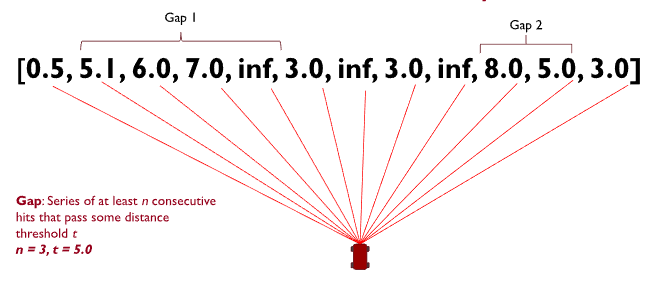
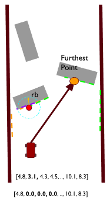

# Planning: Follow the Gap

> NOTE: This chapter is basically just an adaptation of F1/10ths chapter on the same subject (thanks creative commons!).
> Please give their content a look for more [info](https://f1tenth.org/learn.html).

As mentioned before, the first part of our autonomous stack will be the planner, which determines the point we want to
send the kart to.

As discussed prior, what a planner actually does depends on the goal of the robot. In the case of TinyKart, that would
be:

1. Do not hit things
2. Complete laps around an enclosed circuit as with the lowest time possible

Thus, a planner for TinyKart should aim to maximize these goals. The planners introduced in this chapter will not be the
best for this task, but show a possible approach.

Considering these goals is important, as many existing approaches to planning (such as A*) don't make a ton of sense
in the context of TinyKart, and will lead to suboptimal results, even if they are completely acceptable in other
contexts.

## Naive Follow the Gap

First off, we will introduce planners using F1/10ths follow the gap. This is an incredibly basic algorithm that decides
the next point to head to by simply finding the center point of the largest gap in each scan.



Based off this description, the algorithm would look something like:

1. Given scan
2. find the start and end index of the largest gap
3. Return target point as `scan[(start_idx+end_idex)/2]`

Of course, this is rather hand waving away item 2. What even is a gap? We can model one as a set of points from the scan
that fulfill two conditions:

1. All points are greater than some distance
2. The points are in a continues sequence

Thus, the algorithm now looks something like this:

1. Given scan
2. for point in scan
    1. if point dist is greater than threshold
        1. increase length of current gap
        2. set the start index of current gap to index of point if this is the start of a new gap
    2. else, a gap has ended
        1. if gap length is greater than threshold
            1. add gap to collection of gaps
        2. reset gap tracking variables
3. If there was an ongoing gap on the far side of the scan when the loop ended, add that gap
4. Find the largest gap in the collection of gaps (Hint: what data structure would be good for this?)
5. return the center point of that gap as the target point

And as it turns out, that's really the best you can make the naive approach. The downfall of this approach is that it 
has a tendency to cut corners, as the kart's limited turning radius means it needs to approach the corner from the far
wall in order to arc properly. The next approach we will discuss will aim to solve this.

### Your turn

> NOTE: This section makes use of C++'s std::optional. If you haven't worked with it before, please check out this
> article [here](https://dev.to/delta456/modern-c-stdoptional-58ga).

While things are still simple, it's time for you to get your hands dirty and get this kart moving autonomously! In this 
section, you will be implementing the above algorithm yourself. To begin, replace your main loop with the following:

<details>
    <summary>code</summary>

```c++
/// Finds a target point to drive to by finding the largest gap in the scan.
///
/// \param scan Lidar scan
/// \param min_gap_size Minimum number of points in a gap required for it to be considered a gap
/// \param min_dist Minimum distance for a point to be considered part of a gap, in m
/// \return Target point to drive to, if a gap is found
std::optional<ScanPoint> find_gap_naive(const std::vector<ScanPoint> &scan, uint8_t min_gap_size, float min_dist) {
    // TODO
}

void loop() {
    noInterrupts();
    auto res = ld06.get_scan();
    interrupts();

    // Check if we have a scan frame
    if (res) {
        auto scan_res = *res;

        // Check if frame erred
        if (scan_res) {
            auto maybe_scan = scan_builder.add_frame(scan_res.scan);

            // Check if we have a 180 degree scan built
            if (maybe_scan) {
                auto scan = *maybe_scan;

                auto front_obj_dist = scan[scan.size() / 2].dist(ScanPoint::zero());

                // If object is 45cm in front of kart, stop (0.0 means bad point)
                if (front_obj_dist != 0.0 && front_obj_dist < 0.45 + 0.1524) {
                    tinyKart->pause();
                    digitalWrite(LED_YELLOW, HIGH);
                }

                // Find target point TODO tune your params
                auto maybe_target_pt = find_gap_naive(scan, 10, 2)

                if (maybe_target_pt) {
                    auto target_pt = *maybe_target_pt;

                    logger.printf("Target point: (%hi,%hi)\n", (int16_t) (target_pt.x * 1000),
                                  (int16_t) (target_pt.y * 1000));

                    // Find command to drive to point
                    auto command = pure_pursuit::calculate_command_to_point(tinyKart, target_pt, 1.0);

                    // Set throttle proportional to distance to point in front of kart
                    command.throttle_percent = mapfloat(front_obj_dist, 0.1, 10.0, 0.15, tinyKart->get_speed_cap());

                    logger.printf("Command: throttle %hu, angle %hi\n", (uint16_t) (command.throttle_percent * 100),
                                  (int16_t) (command.steering_angle));

                    // Actuate kart
                    tinyKart->set_forward(command.throttle_percent);
                    tinyKart->set_steering(command.steering_angle);
                }
            }
        } else {
            switch (scan_res.error) {
                case ScanResult::Error::CRCFail:
                    logger.printf("CRC error!\n");
                    break;

                case ScanResult::Error::HeaderByteWrong:
                    logger.printf("Header byte wrong!\n");
                    break;
            }
        }
    }
}
```
</details>

Don't worry about the loop much for now, as it contains the path tracker you will be making next chapter. A reference
implementation is included here to ensure that you can test your planner. All you need to work on for now is `find_gap_naive`,
which will contain the algorithm detailed above.

Once you have a complete implementation, test it with the tinykart in a relatively constrained space, so the lidar can 
see things. Don't stress too much if it isn't perfect, but try to hack on the algorithm until you're confident you can't 
make it better.

This will likely take quite a long time, possibly days depending on how much time you have to work on TinyKart. Feel free
to take your time with this, and ensure you understand what is happening. This process will be very similar to when you're
working on it yourself, so its important to get this down. 

If you're ever completely stuck, there is a reference implementation in `libs/gap_follow/naive_gap_follow.cpp`. 
I would still try to finish this yourself though, because there are many ways to approach this implementation and things
only get more complex from here.

## An Improved Approach

With that experience under your belt, lets introduce another approach to the problem. This approach can be summarized as
"Throw yourself at the largest wall". 



Essentially, we redefine the largest gap to be the largest continues non-zero 
span of points. This means that our target point will fling us directly at a wall. That's insane! Why would we want to 
do that? The idea is that doing so will cause us to be on the outside of corners, which means that when we corner our
kart will have a wider angle to perform its turn. Done well, this almost looks like a racing line. Of course, with the
current implementation, we will just plow into a wall. So what stops us from doing so?

To solve this issue, we add a "bubble" that removes points in front of the kart. This looks like:

1. Find the closest point in the scan to the kart
2. Find all points r distance away from that point
3. Set all those points to 0

Because our gaps cannot contain zeroed points, this means that the kart _cannot_ continue to head towards a wall, since
when it gets too close, those points are zeroed. This has the effect of the kart bouncing from the largest wall to the largest
wall, which has the desired cornering properties mentioned above.

### Your turn

As it turns out, this bubble approach is actually very similar in implementation to the algorithm you just implemented.
It's main differences is the addition of the bubble, and the definition change of the gap. Otherwise, you are still
searching for the largest gap, and still need to scan the scan for gaps.

Take your prior implementation, and adapt it to this new approach. You will need to modify both the function arguments
and body, but the rest of the code should still be fine.

Once you've got this working, you're at feature parity with the reference kart! As before, a reference implementation of
this algorithm is in libs if you get stuck. Try to avoid using it though, as this will be great practice for working on
larger projects where I won't just hand you a template.

**Good luck!**