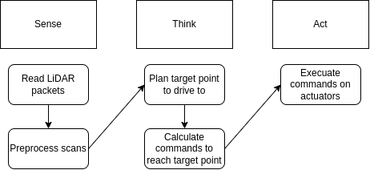

# The Part Where we Make it Move

Ladies, gentleman, baby lidar - it's finally time to make TinyKart autonomous!

This is going to be a multipart process, and be quite a bit more involved than the prior sections. This is why we're
doing this project after all.

## Sense-Think-Act

Before we look into algorithms, I want to give a very brief look at the way mobile robotics is 'normally' done. This
will
be very high level, but should you give you a decent mental model of what we've been doing this whole time.

At a high level, autonomous stacks can be described using 'sense-think-act', a pretty ancient paradigm but one that
works for a simple system like TinyKart.

For TinyKart, sense think act looks like the following:

The idea of sense think act is that most robotics solutions form a pipeline where you read from sensors, plan based off
that new data, execute those plans, and finally repeat this over and over as the sensors get new data, and you progress
towards your goals.

As you can see, you've actually already completed sense and act. All you need to do now is think, and wire it all
together!

## Planning

For mobile robotics, the think step above generally encompasses two main processes:

- Path Planning
- Path Tracking

### Path Planning

Path planning is the act of taking the state of the world as input, and outputting a path for the robot to follow.
How this is done is entirely dependent on your sensors and goal for the robot.

Generally speaking, a path is represented as a sequence of points to follow, rather than a line or something. For
TinyKart, we will actually only plan to a single point as we lack any sort of feedback on our speed, required to
use multipoint paths.

Path planning algorithms span from general algorithms like A* or RRT to bespoke algorithms such as the gap
algorithms you will be writing.

### Path Tracking

Path tracking algorithms take paths from a path planner and actually calculate the command the robot needs to perform to
follow the path. 

By **command**, we mean the value all actuators should be set to continue following the path. Because of this, path 
trackers are independent of the path planner, but do depend on the actuators and geometry of your robot, known as 
**kinematics**.

For multipoint paths, this generally looks like:
1. Sample path to find next point we should head to
2. Determine command to reach this point

For our single point path, we only need to do step 2, which is considerably easier.

For examples of path planning algorithms, see Pure Pursuit, DWB, and MPC.

The following chapters will go more in depth on these two topics.