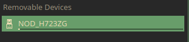
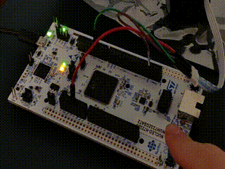

# Setup

Finally, lets set up the tinykart codebase now that everything else is installed.

## Clone

First, lets clone the tinykart codebase using Git. This will effectively copy code from GitHub and onto your local
machine.

To do so:

1. Open a CMD prompt on Windows (you can find this via a start menu search), or a terminal on Linux
2. Use the `cd` command to navigate to the directory you want to keep your code in. For
   example: `cd C:\users\andy\documents\code\` on Windows or
   `cd ~\Documents\code` on *nix.
    1. Keep in mind that some Windows systems have the documents folder direct to onedrive, so documents may not
       actually be in users\user\Documents
3. Clone the repo using: `git clone https://github.com/andyblarblar/tinykart-academy`
4. You should now see a folder called "tinykart-academy" which contains the codebase

## Flash

Next, lets flash the code onto the MCU, and actually see it running. To do this, we need to:

1. Open the codebase in vscode
2. Connect the MCU to the computer
3. Flash using PIO

### Opening codebase in vscode

First, open vscode. This should open to the example project from earlier. To change to tinykart, go to the file tab, and
select the "open folder" option, then open the tinykart folder:

### Connect the MCU

Make sure that you **never** connect power to both of the USB ports at the same time, as this will kill the board.
I have no idea why you would do this, but be warned.

The STM board we use has an integrated ST-Link debugger, which we can connect to over USB to flash the controller,
debug, and more. To use this, connect a USB cable to the port _on the side opposite to the Ethernet jack_. If the port
on the other side is used, then the debugger will not be attached.

You'll know the debugger is correctly connected when the MCU pops up like a USB drive. _Make sure to mount this disk_.
This is how PIO will know how to flash the controller.

### Flash

Finally, we can flash the code to the controller! This will involve compiling the code, creating the firmware file to
flash to the controller, and actually programming the controller with that firmware. Thankfully, PIO makes this process
trivial.

To flash:

1. Head back over to vscode. Find the folder icon at the bottom of the screen, next to the build icon from earlier:
    This button manages the controller we are targeting with this flash.
    1. Click this button, and select the nucleo_h7 option
2. Find the -> button also on the bottom bar. This is the upload button, which will compile and then flash the
   controller.
3. Click the upload button. This will open a new terminal displaying the compilation and flashing process. If
   compile errors occur, they can be viewed here. In this case however, there should be no issues, as the project
   contains only tested code.

If this process has succeeded, a few things will occur:

- The terminal will display success
- The board will have a blinking red LED during the flashing process, and the drive will remount afterwards
- The red, green, and yellow user LEDs on the board will now indicate the state of the system.

To show that it's working, click the blue user button on the board. This will toggle the yellow LED:

Congrats! You now have the tinykart software development environment setup. Before we dive in any further, I would
recommend poking around the codebase and messing with the code. 