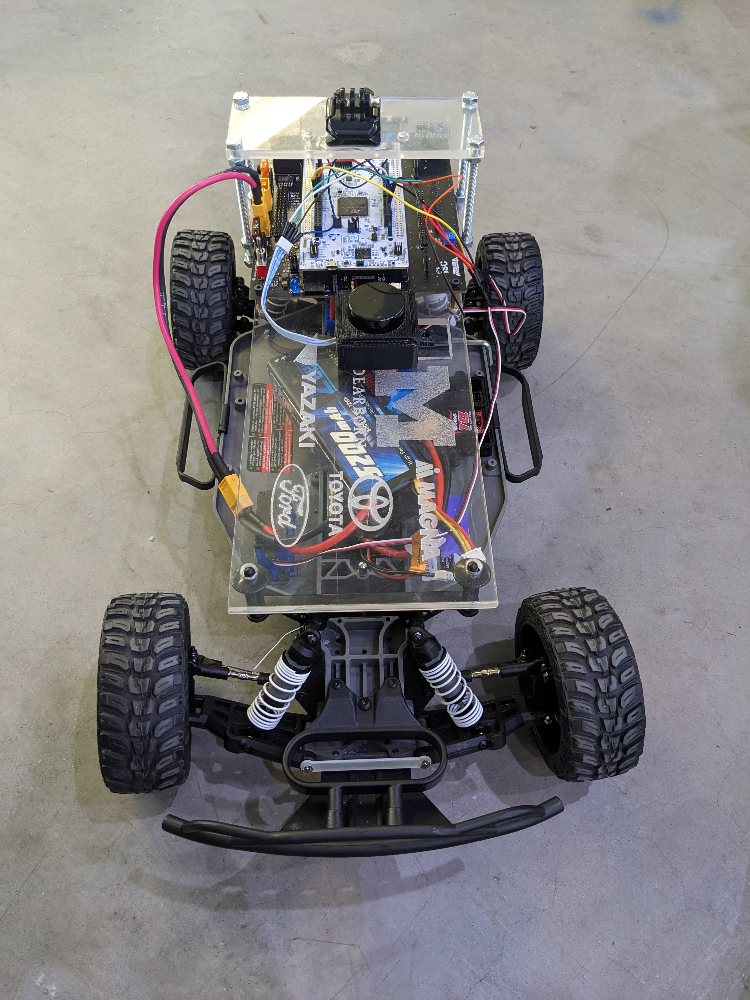

# Introduction to _The TinyKart ™️_

TinyKart is the [Intelligent System Club's](http://iscumd.com) entry level project to introduce new members to 
several areas of robotics, while having a strong supporting codebase to ensure it does not become overwhelming.

This book serves both as a reference and course for anyone looking to make their own TinyKart, or just curious on how 
any part of it works.

**Some topics covered by this book:**
- Setting up an Arduino environment in PlatformIO
- LiDARs, and processing their data
- UART communication
- Interacting with motors
- Ackermann kinematic models
- A basic autonomy stack built around sense-think-act:
  - Basic reactionary planners
  - Pure Pursuit

By the end of this book, you will have created your own implementation of a reference TinyKart. Armed with your newfound 
knowledge, you will then expand on what you've made, and race against other students!

## Prerequisites

While this book assumes little of the reader outside a desire to learn, there are a few things we have to require:
- A Windows or Linux computer
  - Mac may work, but is not tested
- Basic working knowledge of C++
  - This book is about robotics, not C++. The C++ used is not very complex, but may require some googling if syntax is 
    new to you. Additionally, the codebase makes use of modern C++ features like std::optional. When relevant, links to
    external resources are provided for your reference.
- Very basic electrical knowledge
  - If you know what 5V and ground are, you're good.

## Notable topics not covered

TinyKart is deliberately left basic, to fill the gap between something like E100 and F1/10. Because of this, a few major
topics in mobile robotics are not covered, and are best learned through other media:
- Odometry
  - Localisation
  - SLAM and VSLAM
- Computer vision
- Control theory
- DSP