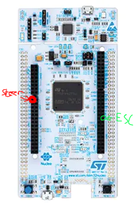

# Moving the Kart

Now that you have given TinyKart its proverbial eyes with the LiDAR, it's time to give it its proverbial legs (this
sounded better on paper lol). Specifically, we will be going over how to actually make the kart steer and accelerate.
Much like the LiDAR, you won't be writing all the driver code, but it's very important to understand how it all works,
since the patters appear all over embedded programming.

## Hardware

Before we can program the hardware, we first need to discuss, well, the hardware! In robotics, anything that can make
a piece of a robot move is called an **actuator**. For example, the wheels on a Roomba, or the claw on Spot.

The Traxxas Slash has two main means of actuation:

1. Steering
2. Accelerating the rear wheels

Steering is achived with a servo motor:

<img style="width: 100%" src="data:image/jpeg;base64,/9j/4AAQSkZJRgABAQAAAQABAAD/2wCEAAkGBxATERESEhIVFRIVFhYXGRcVFRcVFRcXFhUXFhcVFhYYHSggGBolGxcVITEhJSkrLi4uGiAzODMsNygtLisBCgoKDg0OGxAQGy0lHyYtKystLS0vLS0rLS0tLS8tLS0vLS0tLS0tLS0tLS0tLS0tLS0tLS0tLS0tLS0tLS0tLf/AABEIAL4BCQMBIgACEQEDEQH/xAAcAAEAAgMBAQEAAAAAAAAAAAAABgcDBAUCAQj/xAA8EAACAQICBQkGBAYDAQAAAAAAAQIDEQQhBQYSMUEHEyJRYXGBkaEjMkKxwdFScpLhFGKissLwQ1OCFv/EABoBAQADAQEBAAAAAAAAAAAAAAADBAUCAQb/xAA0EQACAQIDBQYGAQQDAAAAAAAAAQIDEQQhMQUSQVGREyJxgaGxMmHB0eHwUhRiovEVI0L/2gAMAwEAAhEDEQA/ALxAAAAAAAAAAAABhxOIhTi5zkoxW9t2RH6uuFJXaw+KnTXxwo3VuvZvtW8ACTA5GiNYcLiUnSqXvwacX25M654mnoetNagAHp4AAAAAAAAAAAAAAAAAAAAAAAAAAAAAAAAAAAAAAAACL6/6XeHwklF2qVXzcbb0n70l3LLvaAONjdISx2LVKm70acrR6m1lKo+vil+5OcJh404qMfPi+1kZ5P8ARfN0eca6Usl3f78iXEVN73f6eH5LOJSpvslw1+cuPktF58yM6f0DnLEYaNqyzlCNkqtuK4Kqlulx3Sut21q9pZVoJN9Ky7Lrg7PNccuDTXA7hB9P0XhMSq8MqdRuTtwnvqJd6W2l1xn1ns013lr7ojp2fcej9H+6k4Br4KuqkIzXFevE2DtNNXRG007MAA9PAAAAAAAAAAAAAAAAAAAAAAAAAAAAAAAAAAAAAVdrfXeK0nChHONFKP8A7k0384/pLKxeJjTpzqSyjCMpPuim38isuTSi6+Jq4mazcpVH+badvWUvIirPu2XHLr+C3gklU7R6QTl00/yaLNwtBQhGC3RSXkjOASpWKjd82Dk6z4DnsLVgl00tqH54dKPna3idYAEC5MNM85TlSbzje3/l2/tcCelQaq1v4bS1fD7oqtOK7pyvH+mcfJFvkNLLejyfvn9S3i1fcq/yjfzTcX7AAExUORrJpWeHo85CCnLaUbN2Wd88u4x6raVqYilKdSMYzUmrRva1k08+9+Rw+UjSajGlQi+k3zj7FG6j5u/6SFPWLFU09itKEna6Vr2fZbI2MPs/t8MrJKTervpcpVcT2dTPRLQuwEc1Ex86+DhOpJzmpTi5N3btJtX8GiRmXVpunUlB6ptdC3CSnFSXEAAjOgAAAAAAAAAAAAAAAAAAAAAAAAAACHcqekea0fOKfSryhSXdJ7U/6IyPvJpgebwak1nN38F+7ZGOVbFOrjMHho/8cXVkv5qj2I+KjGfmWVonDc1QpU/wwS8bZ+tyF96qlyV+uX0ZeX/Xg2+M5W8oq76troboBz9MaShh6TqTUmk0koq8m3uSvkTxi5NRWrKDaSuzoGtpDGQo051Z32IK7sru3YiIS1/T9zDSa/mmo/JM0sdrjWq05U3hY7E001KbaafdYux2diH/AOV1j9yvLF0lld9JfYhemNZcPLGYjERjOFRzi4u12tmMI5q+zfop8Sa6j6/vE1aeGqRbnJTaqPZjfZTnZxXYnmurcQFauUrtuM3f8VWf+NjoaMg8LNyoKNOdveScpWbatedywtj1Ocb+L+xw9oxdlaVvb1LyMVatGEXKTUYpNtvKyW9lQVtM42XvYmfg2l6WPmBxbU/ayclKyvLPZ6muzr8Dt7HkldzXkn+Dj+vT0i/O35MWl8fKtVqYqUW9t+yhZvoLKLkuq1n2tsiS53bbmpXlJ71vJhj9IpNwlJJptNWz9F4o4/PUdpN7UrNO1urPiz6DD91ZRy4eHDkZNabb9zvak6XxdCUoxUZUbqU4Tls78tqDs88u4nlXW6kvdhJ97S+VytXpSTV6dB2XFJ/NJmhU01UXwxXmyjW2fGvU35RSfHP3LMMW6UN1PIu3ROlKdeLcbprJxe9fdHRKT1X1hrwxVF3WzOcYyVrJxlJJ+V7+BdhhY/BvDTS4PNGnhcR20L8UAAUSyAAAAAAAAAAAAAAAAAAAAAADXxuIVOnUqPdCMpeSbAKnwS/itPV6jzjGsoL8tFWfrF+ZcBWPJRg7ynXe+SnPxqzaj/TB+ZZxDTzlKXzt0yLuMe7GlT/jFX8ZNy9ml5A4GucU8LJ9UoP1t8mzvnE1wp3wlTss/W31LuGyrQ8V7mfV+B+BV9D4l1Sl6u/1M6bNePvT70/OKX0NmLPqYLumNL4hma2LWa7n6NG0a+LXu9/zTO1qcmHgNk+pCxKRkbqt7Uu87WrmBjNuc84p2S4N/Y5OMjapNdv1N1YlQpLZlZ23dpYrRco2jxK9NqMrvgdbTOs0YvmqUVJrLdlf8MYreR+o6krylSlFcXsTUV33WRt6rpK8/ilLZve1oq2SbXFt3zW5HU1m1tWGqUaNptTvsqMrJJO13+KTZg1NpxwtR06cLpZXbs21rwZqxwPbwU5ys3y4HAw0rTjJcGn5H6Jpzuk+tJ+ZQmlqEY1IyW6a4K2ae+3C90XfoStt4bDz/FSg/wClEW16ka9GlWjo7/TLyaaOsBB0p1KcuFjfABhGmAAAAAAAAAAAAAAAAAAAAACJ8p+kOZ0biGn0qiVOPfN2+VyWFb8rlVzlgMOviqupLugsv8jxy3U3yJKVPtKkYc2l1djucnOEUMJ3tRX5acVBeqkSw5mruG5vC0I8dhN98uk/VnTI6Md2nFEuNqKeInJaXdvBZL0SBz9PU9rDVl/I35Z/Q6BgxkNqnUj1xkvNMnhLdkpcmVWrpopr4n3L6maDMNVdLz+Z7pyPsramG9TOmYsWsl3o+mPELos5B4jI+T3niLzZ6eZLYj4HD0mrVX2r7GvCg5J2PenMTGNRZSbtuir+PdnvMOj8dF3avbdJPeuonVaPwRa3kr242IHSd99p7t9T1orF83KUW9nO6byV9zTeVty49ZJKlbB1XCdXm3Omm1t5uN7J2tweWRxa+Fp1M759a+qMccNSp5t7T4RyS8UZOI2XTrVXO7V82lbX98TSp4yVOCjZO3H5G7prFc5ONr2Syvk3d32muF8su4uPUqo3gMNdNNQ2c8vdk48e4/Pml8XUVmr3d5ZNq7Tikr9We77F/cn+KlV0bg5yVnzez3qDcE/FRT8ShtSrCEVhYq25b2/JNgoSk3Xk/i+5IwAYxoAAAAAAAAAAAAAAAAAAAAAArbWOPP6WjDfzVOMfGo0v85eRY7dsyvNVIc/jq9fg6rt+Wmm/7qi8iGvnDd5tL98i3g8qu/8AxTfRfexYcYWSS3HoAmKgPh9ABTOlIbNWceqUl8/sYIyOnrjh3TxdRPjJTXdK/wC5yIM+xoS34J/JexiVVaXU2UzzN7zzGRkidkRoJmWDMEX6NryZnps7T7qPGu8R7WahJzvGEpKUUns8PM1MBhnFSlJWlKy2b3aUb5vN5tvdd7jv6Yj0E+p/Q5qh3eLf0OaeEp9r2+e9p8tLX6HNTET7Pscreut/c82tnu7eOe5Lq7zym+19+ZlaS43u/wDbI2MNovEVH7OjOf5Yya9EWZJJ3lkQxbatHPwNSVJSSvGLW/P55ls8lWJk8PVpt3VOa2VwipLcuy6b8SF4bVHSEt2Gayv0nCL8pO5KOSZvaxXdT9HMytpTp1MNNxcW1u6Z8bLPzdvMvYKMoVY3TV76ljAA+WNsAAAAAAAAAAAAAAAAAAAAA52sGJ5vDVp9UGvGXRXzI7ydYa1FSatJxu++pKU5f4+RucotZxwM7cZ0o/qml9Tc1XtsVbK1qso/pSRFP44rx9EWaWVGo1/avU7YAJSsAAAVrymxSr05ddL+2bf1IjGWZMOVGl7WjL8UGvJv7kIozuk+xH1Wz86EPD2ZkYv434/Q3YSMsJmtCZkjIuNFY1pPpS7365/U2KLNau+m/D7fQy0JhfD+8z16mHTUvYyO/wAm+jKFeWJVSlCpKMYSgp3cU25p3S3/AAkf06/YSMuhpWlFNtRk4KVm1eLeaduBW2jUcMDUlHVK+WWjz9Czs/DqvjadNvJu2l+HInUK1Wld7OFoLZylONOjFdFO7Um5qSbsr3T42tnoYjW+jNpy0hBtqHQw0Z1rWnnFxpRmm0s27pScre6s63p4KM9J4mlKdOltuFpToRr1XObjSjTpQk7753lbcot8DsUdE2S53GVqk6cITqU41oYalVnVpSnRVOsrbKtRcXKW9xjmj4mNPtIqUpN3zzf6z6iviHRqypxhBWbXw8n876/6ZI4a/YfCKVecMVVv0LukoKWdotyrz5y9o2tFJZNtPedTknxEZyxUoqykqc0uKUnNpeVit9ctW6NHDVbKc50dmaxEqk5upzmLrYeVJ3ex0YQovopPJvcyYciGJ6Wz+LDrzhKK+rNXBQUaFaEeSfSWZk4urKpWpznre3pl7FvgApkgAAAAAAAAAAAAAAAAAAAABCuVLHUlg5UXNc9N05RjxahUi2+7I29VNKUJSxMI1YNc9KUeks1K+a61kVZyh6WqVsfWlC7pxShB7O0tmmmpWs73c9trsd88iMfxc7XcbpuyTUotuyfFZb/LM4cU2ny+xNCo4wlDnb0d/wAeZ+o0z6QLkmwGMp4epPEybhUcXQW22o0rN+78Ob8rE9OyEAAAgnKpT9lQn1SkvO32K0w88vFrybRb/KFhNvBTl/1tT71ufz9CoaMc5r+f5pP6n0my5p0UuTa+pmYuPefkZ4SM9NmvEyxNMpWPGJ95dsfk/wBz1A8YvfDxX1+h5gzyGj8foj2XDwPmm37CZjw8rNW32TXlY+aWfsZ9x5pxWzB3t0UeVqUa1GVKWkk11ViTD15UK8K0VdxalnplmY8bVqrHzxdKnSqKdOcEq8pxcXUbTkthqSlZtXT3SZh/iMbalH+Io0lTk3FUaCdo2qKNJynnOnFVasYxldJTe82XKC3v1+xnw9anddHfxM+lsnC0opWcrc39rFjEbSxOIqub3Yt8k/Di37nHnouVRSjUr4mrGU3UlF1GoOpLfUcFltO+9E35L8FKli6cYQagoVE+xNXu75+9s+Zy5YmK4kz5LsSp1MTZbo08+Obnl3ZI9xMaVGhN04JXVurS+tzijvzqR35t53LEAB8yawAAAAAAAAAAAAAAAAAAMVe+zK2+zt32yMoAPzPpDD46jeNXCzjNOz6Emrde0rpvfuZ60bKpWrczGEot2zadu3K18j9LAHtzR0PhFSoUqaulGEY55vJJG8ADwAAA5+ncG62HrUlvnCSX5rXj62KLxSdGpKNVOnLLKacM1dPfv4H6ENfGYOlVjs1IRku1XLmFxkqGVrq9/SxDVoqpqfn9Yuk/+SH64/cyxxMOE4fqj9yx9McmGAq3cKcYvuXzRBtL8lMIN2g0uzNGlHam9ol1KzwaXE06k09npRyfBrqa+p9jCXUzh4rUJxfRa8VY0v8A5utTe7y/Yljj/wC31/By8LwuSjFU7waa/wB4mnzmXZ9jWwUKscntep3ak5VaPNSdrZwf4ZfZ7n+x3/yCyTj6/g5/pNc/QjGOxEbpJ5/tY3cM3aPHLd9jSxENp2ktmcXZ963pnZ0FJRr4d33VKT8pxZoRmrNopODTS+ZYur/J/TlShPFbfOSzdOMrKKe6Mmldy68+wmGidD4fDRcaFNQT3u7bdt1282dE+nyFXE1avxSduXDobkaUIaIAAgJAAAAAAAAAAAAAAAAAAAAAAAAAAAAAAAAAAeZRT3noAHKx2hKVT4UmRzH6q290nAJI1ZI5cUVbX0PKO+F/AwPCx4wa8C1J0IPekYXo+n1Eqrnm6UNrbhoQqU5R+OMr5cYtZ+UvQkupugaNWlSrSg5ybb3ytdSaWSfYizq2h6E7bcIytu2op/M2KWDhHJLL0LMse+yVON187kKw8d9yeZiwtWfE3j4oo+mc2WQADwAAAAAAAAAAAAAAAAAAAAAAAAAAAAAAAAAAAAAAAAAAAAAAAAAAAAAAAAAAAAAAAAAAH//Z"/>

Servos are motors that are designed to hold a particular position, rather than continuing to rotate. By adding another
linkage, this rotational angle can be converted to a linear position, thus creating a linear actuator that can hold a
particular
distance. As it turns out, that's exactly how steering works! Essentially, mechanical linkages are geometrically
connected
to the servo such that each far end of the servos range will cause the wheels to reach their max turning angle.

On the other hand, accelerating is something that requires a continues axis, so a servo would make no sense. In this
case,
the RC car simply uses a brushed DC motor:


While discussion on brushed motors is better done by the more electrically inclined, a simple way to understand these
things
is that when you apply a voltage across the two leads, a magnetic field in the motor forms, moving the output shaft:


Critically, the polarity of the voltage across the leads must switch, or else the motor will just stall. Thankfully,
there is dedicated hardware designed to do this for us, called a **motor controller** or **ESC (Electronic Speed
Control)**.
The ESC on the Slash looks like this:


The ESC sits between the battery and the motor, controlling the polarity and power as required to reach some level of
output speed. This means that when we want to move the motor, we need to interact with the ESC.

## Interface

So how to we actually control these actuators? Conveniently, they actually use the same exact interface. That is **Pulse
Width Modulation (PWM)**.

PWM shows up all over electrical things, both as an effectively analog power source, and as a digital signal, as it is
used here.
The idea of PWM is to represent an analog range like 0-100% using a digital signal, which can naturally only be 0 or 1.
While this could be done by sending binary integers, that would be extremely inefficient. Instead, PWM works by creating
set periods of time. Inside these periods, the percentage of time the signal is high versus low is the analog value
itself,
called the **duty cycle**. For a visualisation:


The issue with this approach is that because the duty cycle is time on over period, the frequency of the PWM signal must
be set in stone. For historical reasons, RC cars do not like this, and use a different approch, called **Pulse _Period_
Modulation**.

In this formulation, 0-100% is not the duty cycle, but rather a range of _time_ the signal is high versus low. For
example,
most servos use 1.0ms high for min angle, 1.5ms high for their midpoint, and 2.0ms for their max angle. This approach
means
that any frequency with a period greater than 2.0ms can control the servo, allowing it to work with very cheap hardware.

As it turns out, this is also exactly how the ESC works! The only difference being that 1.0ms is full reverse, and 2.0ms
is full forward power.

## Setting up the hardware

Alright, now it's time for you to set up your controller to connect to these actuators. To do this, we're going to have
to do a tiny bit of wiring to get stuff setup. Each of the actuators has a connector like this:


For the servo these pins mean:

- Red: 5V in, to power the servo
- Black: Ground
- White: PWM control signal in

For the ESC these pins mean:

- Red: 5V **out**, to power the servo
- Black: Ground, to battery
- White: PWM control signal in

Our goals for wiring things up is to:

1. Connect ESC 5V out to servo 5V in
2. Connect ESC and servo PWM to pins on the controller
3. Connect all three to common ground

To do this:

1. Make sure the system is powered off
2. Jump the ESC 5V to servo 5V
3. Jump ESC and Servo ground together using a breadboard
4. Jump a ground pin from the controller to the same breadboard lane as the other two grounds, creating a common ground
5. Finally, jump the ESC and Servo PWM lines to these exact pins:



Red being A0, and green being D0.

Now, connect the battery to the esc, and power to the controller. Now, press and hold the little blue
button on the ESC to turn it on. Finally, reset the controller. You should see the kart do a little jump, and
maybe move its wheels. This is good! This means that the ESC is armed, and ready to move.

## The code

Now that things are hooked up, you can move the kart with commands on the TinyKart class:

```c++
tinyKart->set_forward(command.throttle_percent);
tinyKart->set_steering(command.steering_angle);
```

Feel free to explore the other methods on the class, as they allow for movement in other ways, such as in reverse.

While this high level API is all you will be working with for the autonomy, I want to briefly show how its implemented:

```c++
{{ #include ../../lib/tinykart/esc.hpp:50:57 }}
```

As you can see, its actually rather simple, thanks to Arduino. I want to untangle that second line for you, since
there's
really two things going on here.

First, the value of that line is the value we are setting the hardware PWM peripheral's register to control the duty
cycle. Because PWM is digital, we can only output duty cycle percents up to some resolution in bits. Think of these as
buckets,
and the more buckets we have the more we can slice the 0-100% range into finer pieces to uniformly distribute among the
buckets. For example, Arduino defaults to an 8 bit PWM, which means that setting the register to 255 will be 100% duty
cycle,
0 will be 0%, and 255//2 will be closeish to 50%.

In the case of our ST board, we have a 12-bit PWM, which means that we have 4092 "buckets". This means to select some
percent
duty cycle, you use the equation: \\( power * 4092 \\), where power is in range \[0, 1\].

Second, the `analogWrite` call sets duty cycle, not duty width, which is what we're looking for. This means that we need
to map our desired percent first from percent to width in ms, then from ms to duty cycle, then duty cycle to register
value. This is exactly what that one-liner is doing. From left to right:

1. Our forward time range is 1.5-2.0ms, so divide our power by 2 and add it to 1.5, to get our desired percent in time
   domain.
2. We need this time width in duty cycle, so we now need to find the percent of time that width takes out of the
   complete PWM period.
   To do this, we just divide by the period, which is just a constant set in `setup()`.
3. Finally, take this 0.0-1.0 duty cycle and multiply it by the max register value (4092 here) to get the value to write
   to the register.
4. Write the value to the register using `analogWrite`.

The servo works exactly the same, except split over left vs right rather than reverse vs forwards.

### Stop and think

Now I said this is important to understand, even if you won't be writing it. Now's the time to ponder how this setup
could
influence the autonomy. Before you see the explanation, please think this over for a moment, to make sure you have a
good grasp on things.

<details>
  <summary>An answer</summary>

I would say this setup has two main consequences upstream in the autonomy stack:

1. Latency
2. Precision

First, because PWM signals have a set period width, this limits the rate at which we can update the steering and speed,
since we must wait for the prior PWM period to end before we can change the duty cycle. While this isn't of massive
significance,
It's something to consider as adding, ex. 10ms of latency at 100Hz (what the reference code you have is using) is
actually
quite a large value on the embedded world.

Second, 12-bits of resolution is quite high, but because we are stuck with only using small period ranges, we actually
have very little resolution. This means that while you can still get rather specific with your steering angles (
certainly fine for our use),
small angle increments can sometimes have no effect or a large effect depending on if it causes us to step into
another "bucket".

While neither of these are really something you need to worry about, its worth taking the time to think about how your
hardware will constrain your autonomous routines, as this is something that is far more pronounced on a full size
vehicle.

</details>

## Homework

Alright, now it's your turn to make the funny RC car move. Keep building off your last code, although you will need to
hack it a bit.

Your challenge today is to make the kart slow proportionally to the distance in front of it. This will be very useful in
the autonomous routines later, as it will help prevent the kart from sliding around. Doing this will require you to use
distance values from the LiDAR again, but with it facing forward as is proper. Specifically, the kart should be able to 
avoid hitting an object with much speed, and preferably stop before hitting it at all. Consider experimenting with
using reverse as a brake. 

Start slow and build your way up in speed and see how fast you can go! This experience will come in handy later when 
testing autonomous things.

Note that when the kart boots, it starts in a paused state, indicated by the yellow LED. In this state, it rejects all
commands. To allow it to move, press the blue button. Press the button again to stop the kart (this is what you were
doing the first day!). If you want to use this functionality in your own code (like to stop if the kart hit something):

```c++
tinykart->pause(); // Stops
tinykart->unpause(); // Starts
```

Some notes before you start:

- When running the kart in motion, make sure everything is well secured. Perhaps consult your friendly ME peers to see
  how to do this well. In particular, if ground is disconnected the kart goes wild, so be careful.
- The controller can be powered off of mobile battery banks, not just from a laptop. Use this to make the kart cordless.
  The controller will boot to its last flashed code.
- The kart is fast! On slippery floor especially it can really get away from you, so I recommend capping the speed at
  around
  0.3 at most. It also tends to stall around 0.15. For grippier floors like carpet, move that range up a bit.

To set the karts max speed, modify the 3rd parameter in the TinyKart constructor:

```c++
{{ #include ../../src/main.cpp:47 }}
```