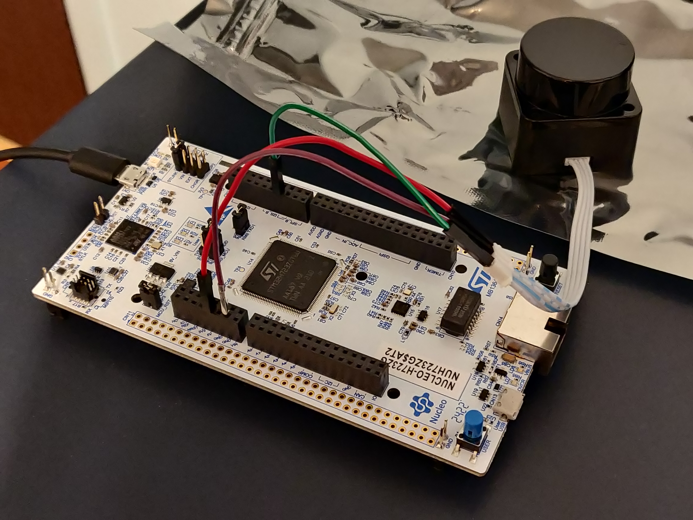

# The Baby Lidar ☺

It's finally time to play with our first piece of hardware!

I would like to introduce the LD06, AKA Baby LiDAR!


## LiDARs

So why do we even have a LiDAR? Well, LiDARs provide a means to get a slice of the world around you as distance data.
This is extremely useful for mobile robots, since there really isn't another sensor that can give the same field of view
as a LiDAR.

Generally speaking, there are two kinds of LiDAR, 2d and 3d. 3d LiDARs get distance values with both a vertical and
horizontal angle. 2d LiDARs, like the LD06, only get distance values from a flat plane. This makes them far less
versatile in the real world, but significantly easier to work with and cheaper.

To get a mental model of how a LiDAR works, think of a laser rangefinder, such as those used in golf. You point it at
something, and it gives a distance reading at some frequency. Now think about what happens if we put that rangefinder
on a spinning motor. as the motor spins the rangefinder, the rangefinder will read a different location each time,
with a density of points proportional to is frequency. Given a high enough frequency, this readout will give you a
2d slice of the world around you as polar coordinates.

For a visualization, take a look at this diagram from the LD06 user manual:


Like all sensors, LiDAR has operating limits. For LiDARs, these limits are generally its frequency and range.
Unsurprisingly,
the LD06 is pretty bad at both, reading at 10Hz with a max range of 8-10m. This means that care needs to be taken to
avoid outpacing the speed of the LiDAR itself.

## UART

The LD06 of course needs to connect to our board somehow. While industrial LiDARs generally use Ethernet for this
purpose,
our little baby lidar uses UART. UART, or RS232 (kinda, I'm not opening that debate) is a very simple protocol for
communication between embedded processors. While I won't get super into the weeds with how UART is implemented, think of
it as a very minimal layer over the idea of sending data over a wire as binary via high and low signals. In hardware,
UART is implemented (In most modern uses) as simply two or even just one wire, like so:


UART is
an asynchronous protocol, that is, it does not have a clock line. This means that without prior configuration, the
receiver would have no way of knowing how fast the sender plans to send high and low bits. For UART, we call this
rate **baud**, measured in bits per second (effectively). This gives the advantage of removing the clock wire and thus
requiring less hardware, at the expense of anguish if you configure your reciver to a different baud than the sender.

Also worth noting is that UART has no link-layer error detection, so higher layer protocols using UART almost always
include error detection methods such as Cyclical Redundancy Checks (CRCs) to ensure data integrity should there be
electrical noise in the system.

## Connecting Baby Lidar

<div class="warning">
Be careful with the baby lidar! They scratch very easily, which may lower accuracy.
</div>

Preamble aside, lets get the Baby connected. From the manual, the LD06 has the following pinout:


As you can see, the LiDAR actually only has a UART transmitter, which means we will only need a UART receiver (Rx) on
the
board side. The PWM input is unused, and the other two pins are simply power and ground.

While there are a variety of ways to connect these to the board, TinyKart is configured to use the following pins:


Go ahead and connect these to the respective pins on the wire connected to baby lidar. The end result should look
something like this:



<div class="warning">
Before you add power to the board, PLEASE double-check the ground and 5V pins. If these are swapped then the
LiDAR could be damaged.
</div>

With that being said, it's time to see the little guy come to life! Just plug in the board, and the LiDAR should spin to
life!


## Reading Baby Lidar

First off, we need to figure out how to actually read the UART line connected to the LiDAR. This can be done in one of
two ways:

- Polling: Checking if a byte has been received in the arduino loop()
- Interrupts: Having hardware call an interrupt request handler (IRQ) function whenever a byte arrives

Generally, polling is going to be slower but more convient, whereas interrupts require hardware support but allow for
hardware to communicate in parallel with your programs' execution.

By default, Arduino essentially only allows for polling, as it uses the IRQ itself behind the scenes. This unfortunately
is actually too slow for how fast the LiDAR runs, so we have to make our own approach using interrupts. This is actually
quite complex and delves into STM HAL code, so the code won't be discussed here (if you're curious, check the dma.cpp
file).

The LD06 sends its data in frames with the following format:


As you can see, each frame from the lidar will be 47 bytes, and contain data between some start and end angle. Notice
how
all data is in large integer values. This is because sending floats over the wire is quite inefficient, so we simply
scale
up the values and use ints instead. The LSB and MSB refers to least and most significant bit respectively. This
indicates
the endiness of the data, or the ordering of each byte in multibyte structures. For example, if `0x270F`(9999 decimal)
is
sent over this UART protocol, then it will actually be read and sent as `0x0F27`. While this seems insane, this is
actually
how the ARM processor on the board _already_ stores the ints. So by doing this, we can do simple C pointer magic to read
the two bytes as a 16-bit integer:

```c++
{{ #include ../../lib/ld06/ld06.cpp:62 }}
```

With all this layed out, our approach looks like the following:

1. LiDAR sends bytes over the UART
2. UART peripheral triggers IRQ
3. We copy a single byte to a buffer of bytes in RAM (literally just a uint8_t array)
4. Repeat until we have 47 bytes
5. Once we have 47 bytes, we need to figure out where the frame starts. To do this, we find the 0x54 start header. Align
   the buffer to now start at this byte.
6. If that were to make us under 47 bytes, exit and wait for more
7. Else, process the frame data into a C++ struct using the above pointer technique

This approach is implemented in the ld06 driver provided for your use.

## Review

Alright, that was quite the infodump. Let's take a look at the code you'll be working with, and actually see what this
looks like in action.

Open main.cpp.

On line 15 you'll see the creation of our driver:

```c++
{{ #include ../../src/main.cpp:15 }}
```

Farther down in the setup, you'll see us configuring our callback to copy the buffer to the driver in the IRQ:

```c++
{{ #include ../../src/main.cpp:49:53 }}
```

Finally, we poll the driver to see if a scan has been processed in the loop:

```c++
{{ #include ../../src/main.cpp:60:62 }}
```

Interrupts are disabled around the LiDAR to avoid issues when a new buffer arrives and starts copying right as we read
the previous buffer (known as a _race condition_).

The processed scan frames have the following layout:

```c++
{{ #include ../../lib/ld06/ld06.hpp:22:34 }}
```

Remember that each range is just a distance reading, which occurred at some angle. To retrieve this data,
we must interpolate the index with the start and end angles:

```c++
{{ #include ../../lib/ld06/ld06.hpp:43:51 }}
```

With this, we have all that we need to interpret frames from the LiDAR! Armed with this information,
I recommend messing around with main.cpp to log data read by the board, and monitor the results by using the PIO
monitor.

To open the monitor, first find the terminal icon in the bottom gutter near the upload button. This will open a terminal
with the `pio` command sourced. Next, open a monitor to view the boards printfs by
running `pio device monitor -b 115200`.

## Scan Building

Cool, so we can read frames. As it turns out, this actually isn't all that useful. This is because each frame actually
only covers a very small region of the overall scan. This makes sending the LiDAR data much easier, but makes processing
on our end a bit more complicated. To remedy this, we must assemble scans by hand, as we receive frames. During this
process,
we can also do other forms of filtering on the frames to make the data easier to work with. This is generally called
_scan preprocessing_,
and is done on actual industrial robots.

Our approach:

1. for each frame:
    1. If frame is in the range we want to read
        1. If reading is noisy, ignore it
        2. Convert each range to (x, y) coordinates about the lidar, from polar. Store this in a buffer.
    2. else, if the last frame was in range, and thus our desired scan area is full, return the completed scan.

This is implemented in the ScanBuilder class:

```c++
{{ #include ../../lib/ld06/ld06.hpp:184:226 }}
```

In the tinykart default implementation, this is configured to read from -90 to 90 degrees:

```c++
{{ #include ../../src/main.cpp:18 }}
```

## Putting it all together

Time for you to get your hands dirty! Before anything else, replace your loop with the one below:

```c++
void loop() {
    noInterrupts();
    auto res = ld06.get_scan();
    interrupts();

    // Check if we have a scan frame
    if (res) {
        auto scan_res = *res;

        // Check if frame erred
        if (scan_res) {
            auto maybe_scan = scan_builder.add_frame(scan_res.scan);

            // Check if we have a 180 degree scan built
            if (maybe_scan) {
                auto scan = *maybe_scan;
                
                logger.printf("*****START SCAN******\n");
                for (auto &pt: scan) {
                    logger.printf("Point: (%hu,%hu)\n", (uint16_t) (pt.x * 1000), (uint16_t) (pt.y * 1000));
                }
                logger.printf("*****END SCAN******\n\n");
            }
        } else {
            switch (scan_res.error) {
                case ScanResult::Error::CRCFail:
                    logger.printf("CRC error!\n");
                    break;

                case ScanResult::Error::HeaderByteWrong:
                    logger.printf("Header byte wrong!\n");
                    break;
            }
        }
    }
}
```

This code builds on the review section, and now also prints out completed scans, once they are built. Flash this to your
board, and open the PIO monitor. You should see data blaze by.

Try putting our hand around the LiDAR. You should see the values lower. Something to note about these cartisian
coordinates
is that they are in right-hand-rule. That is, x is positive forwards and y is positive to the left. This is the standard
coordinate system in robotics.

### Homework

Now it's time for your challenge. Given the above code, create a program that prints "GOTCHA!" whenever someone
is 50cm or less from the _back_ of the LiDAR. This will only require modifying things in main.cpp, and only in loop and
the globals. If you have any questions on units, formats etc., read the docs in the code! This is good practice for
working
on larger projects, since rarely will there be guides as verbose as this one to step through the code.

Good luck!